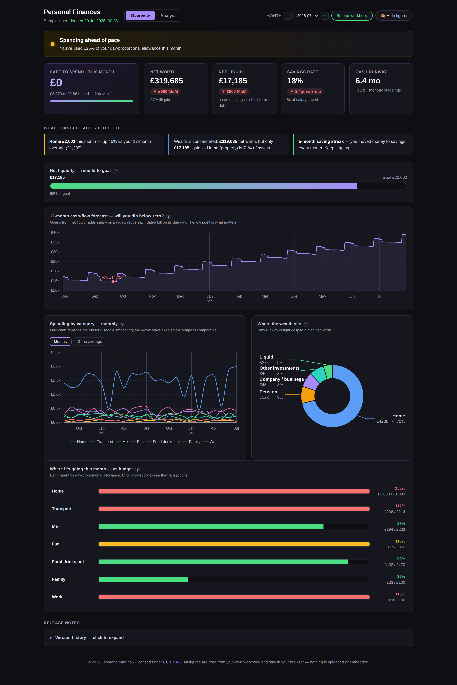
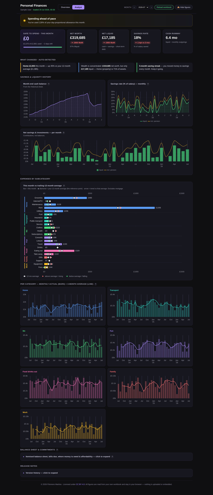

# Personal Finance Dashboard

A personal-finance tracker and the dashboard that reads it.

This repo gives you two things: a **spreadsheet laid out in a particular structure**,
and **one HTML file** that turns it into a decision-first **Overview** (are you on
track? how much is safe to spend?) backed by a full **Analyst** view. The numbers are
yours; the layout is the part that has to match.

It is not a "point it at any spreadsheet" tool — the dashboard reads specific sheets
and columns, listed in [SCHEMA.md](SCHEMA.md). Start from the blank template included
here and you're already conforming. Within that structure everything is yours:
categories, subcategories, account names, currency, colours and groupings are all
derived from what you type, so you never edit code to recategorise.

The interface speaks **English, Italian, Spanish, French and German** — pick one from
the header. Your own labels are never translated: a category you called `Groceries`
stays `Groceries` in every language.

**Your data never leaves your device.** The dashboard reads your workbook entirely
in the browser (via [SheetJS](https://sheetjs.com/)); nothing is uploaded, embedded
or transmitted. There is no server, no build step and no account. There is also a
one-click **privacy mode**, so you can show the dashboard to someone without showing
your numbers.

### ▶ [Try it now](https://filomenomartina.github.io/personal-finance-dashboard/)

Opens in your browser — nothing to install, nothing to download. Click **Load
workbook**, pick the sample spreadsheet from this repo, and have a look around.



## Try it in 30 seconds

**Hosted:** open <https://filomenomartina.github.io/personal-finance-dashboard/>,
then click **Load workbook** and choose `finance-tracker-SAMPLE.xlsx` (download it
from the file list above).

**Local:** download this repo (**Code → Download ZIP**, or clone it), open
`index.html` in Chrome, Safari or Firefox, and load the same file.

Either way you'll see the dashboard populated with fully synthetic sample data —
that's what the screenshots show. Press **H** (or the **Hide figures** button) to
try privacy mode.

Both routes are equally private: the hosted page is the same single file, served as
a static page. Your spreadsheet is read in your own browser and never sent anywhere
— there is no backend to send it to.

> The page needs an internet connection the first time you open it, only to fetch
> Chart.js and SheetJS from a CDN. See [Offline / self-hosting](#offline--self-hosting).

## The two views

Everything is driven by one **Overview ⇄ Analyst** toggle and a global month selector.

**Overview — decide.** An on-track / watch-your-cash verdict; a **safe-to-spend**
hero; net worth, net liquid, savings rate and cash-runway tiles each with
month-on-month deltas; auto-detected "what changed" cards; a net-liquidity rebuild
goal; a 12-month daily cash-flow forecast that shows where the low point falls; one
consolidated spending-by-category trend; a wealth-composition donut; and
click-to-drill budget-vs-actual rows.

**Analyst — the detail.** Month-end cash, savings rate and net-savings history;
expenses by subcategory (bars, a 12-month-average diamond and a trend arrow per
row); per-category small multiples; and a collapsible balance sheet / bills-due /
where-money-is-owed / affordability panel.

Every panel has a **?** badge with a plain-language explanation, and all the time
series share a continuous monthly axis with quarter gridlines.

## Languages

The **Language** picker in the header switches the interface between English,
Italian, Spanish, French and German, and remembers your choice for next time.

Where the initial language comes from, in order:

1. **Your last pick** in the header, if you have ever made one.
2. **`Config!SETTINGS` → `Language`** (`en`, `it`, `es`, `fr` or `de`) — the
   workbook's own default, useful when you share a template with someone.
3. **Your browser's language**, if it is one of the five.
4. English.

Number, date and month-name formatting follow the chosen language — Italian shows
`£1.234,56` and `30 lug 2026` — **unless** `Config!SETTINGS` names an explicit
`Locale`, which always wins. That lets you read the interface in Italian while
keeping British number formatting, or the reverse.

Translated: every label, heading, help tooltip, chart legend, verdict and insight
sentence. Not translated: anything that came out of your workbook — category and
subcategory names, account names, wealth-group labels you defined yourself, and the
version history in the release notes.

### Adding a language

The translation table lives in one `<script>` block near the top of the file. Add one
entry to `LANGS`, copy the `en` block in `DICT` under your language code, translate the
values, and add a fallback locale in `DEFLOC`. Nothing else in the file changes — no
code path reads a language code directly.

## Putting your own numbers in

Only two sheets are required — `Accounts` and `Transactions` — and within them only
the sheet names, the section headers and a handful of column positions are fixed.
Everything else is yours: reclassify in the spreadsheet, reload the page, done. Every
other sheet is optional; leave one out and the panels that need it are simply skipped.

Two workbooks ship with the repo:

- **`finance-tracker-TEMPLATE.xlsx`** — *blank*. Every required sheet, section
  header and column header already in place, plus one clearly-marked example row
  per section. Delete the example rows, keep the headers, fill in your own data.
  **This is the recommended starting point.**
- **`finance-tracker-SAMPLE.xlsx`** — the same schema *filled with synthetic data*,
  so you can see a fully-populated dashboard before committing to anything.

Field-by-field documentation is in **[SCHEMA.md](SCHEMA.md)** — read it if you want
to adapt an existing spreadsheet of your own rather than start from the template.

Both workbooks are generated by a script you can re-run any time
(needs `pip install openpyxl`):

```bash
python3 make_workbooks.py            # writes both
python3 make_workbooks.py template   # just the blank one
```

## Making it yours — the `Config` sheet

By default the dashboard **auto-derives** everything. If you want to pin how it
looks and behaves, the optional `Config` sheet has five blocks:

| Block | Controls |
|---|---|
| `SETTINGS` | Currency symbol, locale, UI language, the name in the header, how far back the long-run charts go |
| `WEALTH GROUPS` | How investment lines group into the wealth donut |
| `CATEGORIES` | Colour and display order of your spending categories |
| `ACCOUNT GROUPS` | Which bills are card repayments rather than purchases |
| `THRESHOLDS` | When the dashboard warns you — runway, budget pace, insight sensitivity |

Nothing personal lives in the code: change `Currency symbol` to `€` and the whole
dashboard re-denominates, privacy mode included. Delete the sheet entirely and it
all falls back to auto-derivation. Layouts are in
[SCHEMA.md](SCHEMA.md#config--optional); both shipped workbooks include a
filled-in example.

## Privacy model

- **In-browser only.** Figures are read from the file you pick and held in memory.
  Close the tab and they're gone.
- **No network calls carry your data.** The only external requests are the two
  `<script>` tags that load the charting and spreadsheet libraries.
- **Privacy mode** (button, or `H`) blurs every figure and hides chart axes, labels
  and tooltips — for screen-sharing or screenshots.



## Offline / self-hosting

`index.html` loads two libraries from cdnjs. To run fully offline, or to pin exact
versions, download them next to `index.html` and repoint the two `<script src="…">`
tags in the `<head>`:

- Chart.js 4.4.0 — `chart.umd.min.js`
- SheetJS (xlsx) 0.18.5 — `xlsx.full.min.js`

For a hosted version, enable **GitHub Pages** on this repo — `index.html` is served
as the site root, so anyone can use the dashboard from the Pages URL, still loading
only their own local file.

## Testing changes

`test_dashboard.py` drives the real file in headless Chromium against a generated
workbook and reports what actually rendered, so an edit that quietly breaks a panel
fails loudly instead of silently:

```bash
pip install playwright && playwright install chromium
python3 make_workbooks.py
python3 test_dashboard.py index.html finance-tracker-SAMPLE.xlsx
```

It prints every headline figure, how many rows each container drew, how many points
each chart holds, and any console error or warning. Run it before and after a
change; the numbers should match.

`test_i18n.py` covers the translation layer: it loads the dashboard in all five
languages, checks the figures are digit-for-digit identical while the surrounding
words are not, switches language live through the header picker, and asserts that
privacy mode still leaves no unblurred figure in any locale.

```bash
python3 test_i18n.py index.html finance-tracker-SAMPLE.xlsx
```

## Tech

Plain HTML, CSS and JS in one file — no framework, no bundler, no backend.
[Chart.js](https://www.chartjs.org/) for charts, [SheetJS](https://sheetjs.com/)
for reading `.xlsx`. Python + `openpyxl` generates the two workbooks.

## Licence

[CC BY 4.0](LICENSE) © 2026 Filomeno Martina. Free to share and adapt with attribution.
